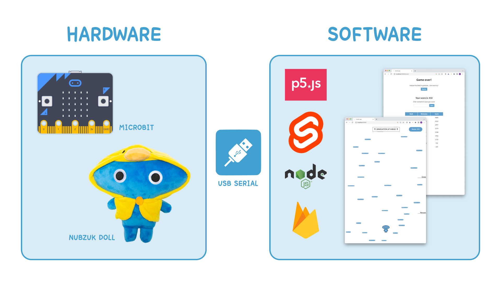

# NubzukJump

> _"Will Nubzuk be able to graduate?"_

## Student Information

- Name: 이지윤 (Nicole Lee)
- Student ID: 20200510
- Email: nicolelee2001@gmail.com
- Github Repo URL: [https://github.com/babycroc/NubzukJump](https://github.com/babycroc/NubzukJump)
- YouTube Video URL: [https://youtu.be/zIJ6Htx8L8w](https://youtu.be/zIJ6Htx8L8w)

## Introduction

### Motivation: Doodle Jump

Nubzuk Jump is a simple game motivated from the mobile game [Doodle Jump](https://en.wikipedia.org/wiki/Doodle_Jump). In Doodle Jump, there is a main character called _the Doodler_ - who keeps jumping upwards, avoiding obstacles and collecting items. On the mobile, users tilt the phone to move the Doodler, and tap the screen to shoot monsters. There is no concept of "winning" the game - the player's score is calculated based on the height the Doodler reaches. The game ends when the Doodler falls, bumps into obstacles, and etc. Nowadays the game has expanded to have set of various themes that the player can choose, where each theme provides additional features.

### Nubzuk Jump

#### Storyline

The main character of the game is _Nubzuk_, a KAIST graduate student who has ~~still~~ not graduated yet. Our goal is to help Nubzuk graduate by jumping up and up following the picket showing the direction to graduation! But watch out - you may meet KAIST geese on the way, they are the favorite's of the KAIST president and are strong (at least stronger than the graduate students) - if you bother them, they will block your graduation! (And FYI, there is no way that a graduate student can win against a goose. They don't have the power to.)

#### Rules

The basic rules of Nubzuk Jump are the same as Doodle Jump, however the motion of tilting the phone to move the Doodler has been changed to **tilting an actual Nubzuk doll** with your hands. Also, the game has been simplified to leave only the core features of Doodle Jump - jumping, bumping into obstacles, and calculating the score to be shown on a scoreboard - to match [the storyline](#storyline) of Nubzuk Jump.

## Implementation Description

### Overview


<br/><br/>

The architecture of the game is simplified in the diagram above. The game consists of hardware and software, which communicates using the USB serial port. To run the code, you must follow the steps below:

1. Prepare a [BBC micro:bit](https://microbit.org/) (I used the microbit v1) and connect it to your computer that you will run the software code.
2. Upload the code in `microbit/makecode.js` to the microbit using [MakeCode](https://makecode.microbit.org/). Make sure your microbit device is connected and paired to your computer with a USB cable.
3. Install dependencies by running the command `npm install` in the root directory and the `node-server` directory.
4. Run the backend server in the directory `node-server` by using the command `npx nodemon index.js` to receive serial monitor output and send it to the frontend using socket connection.
5. Create a [Firebase](https://firebase.google.com/) project and create a Realtime database. Save the configurations in a `config.js` file under the directory `src`.
6. Run the frontend using the command `npm run dev` in the root directory.
7. Open a browser with the url `http://localhost:8080/` (or whatever url the terminal tells you to go to) to play the game!

### Hardware

The hardware part consists of a [BBC micro:bit](https://microbit.org/) v1 and a [Nubzuk doll](https://brandkaist.com/product/nubzuki-robe/). We use the built-in acceleration sensor to collect tilt information of the microbit, which is placed on the back of the Nubzuk doll. Code for the microbit can be found in the `microbit` folder. It is uploaded to the microbit using [MakeCode](https://makecode.microbit.org/), as explained in the instructions above.

### Software

The software part consists of a frontend made with [p5.js](https://p5js.org/) and [Svelte](https://svelte.dev/) for the game itself, a backend [Node.js](https://nodejs.org/en) server to receive serial monitor output from the microbit, and a [Firebase](https://firebase.google.com/?gad=1&gclid=CjwKCAjwvJyjBhApEiwAWz2nLU2CFVKgJP0FaDGtg6zB1St7PxsQ3iaT7Y_KT8HIgnB0WPGIYH00MhoCF2UQAvD_BwE&gclsrc=aw.ds) Realtime database to save scoreboard data for the game. For communication between the frontend and backend to send the recieved serial monitor data, we use [Socket.io](https://socket.io/).

#### Frontend: p5.js and Svelte

The game consists of two pages, 1. the [main page](http://localhost:8080/) (a page where you can play the game, implemented in `src/MainPage.svelte`) and 2. the [score page](http://localhost:8080/score) (a page where you can see the scoreboard data, implemented in `src/ScorePage.svelte`).

On the main page is the p5.js sketch, which shows the elements needed in order to play the game. The most important elements are Nubzuk (the main character), the platforms which Nubzuk step on to jump upwards, and the geese which are obstacles in the game. I implemented these elements using OOP, as each has concrete properties and methods and are reused a lot.
Background objects (the platforms and the geese) are handled by an additional `Objects` class, which saves platforms and obstacles of the game. Although there are not many types of background objects or obstacles yet, I expect that adding more can be easily handled using such OOP structure. The `Objects` class and the `Nubzuk` class is implemented using the singleton pattern, where the `Objects` class also acts as a factory to create the platforms needed on the initial screen or whenever the Nubzuk jumps and new objects are needed.

I tried to organize the code by keeping repetitively used constants in the `src/constants.js` file, and functions in the `src/utils.js` file. Images and icons are in `src/lib/assets`.

#### Backend: Node.js server and Socket.io

The Node.js server is needed to receive serial output from the microbit and send it to the frontend using Socket.io. It runs on port `3000` while connecting to the frontend which runs on port `8080`. Socket configuration for the frontend is done in the file `src/socket.js`, and setup for the backend is done in the file `node-server/index.js` along with serial port connections. Serial port connections will be explained further in [the section below](#usb-serial-port-connection).

#### Database: Firebase Realtime database and local storage

Firebase Realtime database is used to save scoreboard data. On the score page, the top 10 scores are shown in a table along with the player's nicknames. On the main page, scores are displayed on the right side of the screen along with the platforms and geese to motivate players to beat others.

When the game ends and a score is given, the browser's `localStorage` is used to retrieve the score from the main page to the score page. The score is displayed on the screen, along with an input for the player's nickname. The player may choose to or to not save their score. If they decide to, the nickname input and score data is stored in the Firebase database.

### USB Serial Port Connection

Code for USB serial port connection is in the file `node-server/index.js`. The following code is a part of this file. My microbit is connected to the serial port `dev/cu.usbmodem1102`, and receives serial monitor output with a baud rate of `115200`. The data is sent as a JSON string, which is read using a parser to then be sent to the client using the socket.

```js
const { SerialPort } = require("serialport");
const { ReadlineParser } = require("@serialport/parser-readline");

...

const serialPort = new SerialPort({
  path: "/dev/cu.usbmodem1102",
  baudRate: 115200,
  parity: "none",
}).setEncoding("utf8");

io.on("connection", function (socket) {
  serialPort
    .pipe(new ReadlineParser({ delimiter: "\r\n" }))
    .on("data", function (data) { ... });
});
```

## Future Development

- To move the background objects as Nubzuk jumps upward, I split sections and used the `delay` function to make it look like a smooth animation. However, if there are lots of platforms the motion sometimes gets a bit laggy. Also, the scores of others on the right side of the screen do not move in the same speed of the background, so this also seems a bit awkward. I wish to fix this in the future by using 2 different coordinate schemes - absolute coordinates and coordinates of the player's view.
- Currently there are not many features dur to the storyline and because I spent a lot of time with the serial connection. However, I wish to add more features such as different types of obstacles or platforms, ways that Nubzuk can attack, or maybe even ways to actually graduate! I plan to extend the OOP pattern as it is easy to add new objects.

## Help

- I received help from Soonho Kwon - he recommended me to look at the Euler's method when implementing the Nubzuk's jump movement to make it smoother
